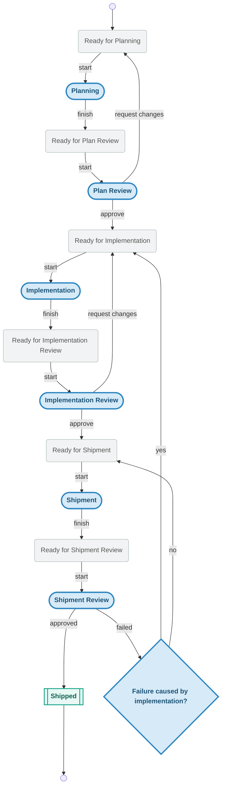

# Knots

[![CI][ci-badge]][ci-url]
[![Coverage][coverage-badge]][coverage-url]
[![License: MIT][license-badge]][license-url]
[](https://discord.gg/KPgNPMAzrP)

Knots es un sistema de enfoque local-first respaldado por git, diseñado para ayudar a humanos y agentes a comprender lo que hicieron, lo que están haciendo y lo que planean hacer a continuación. Utiliza eventos de solo anexado junto con una caché de SQLite para mantenerse rápido localmente mientras permanece sincronizable a través de git.

## Demo


Un breve recorrido por `init` -> `new` -> `ready` -> `poll --claim` -> `update` -> `next` -> `show`. Fuente del cast en [`assets/demo.cast`](assets/demo.cast) para `asciinema play` o inspección amigable para copiar y pegar. La grabación se genera con [`scripts/demo.sh`](scripts/demo.sh), que crea un repositorio git desechable y un remote bare local en directorios temporales, ejecuta el ciclo de vida canónico de un nudo y elimina los directorios temporales al salir. Para volver a grabar:

```sh
make demo       # prints the asciinema rec command
make demo-gif   # converts the cast to assets/demo.gif (requires agg)
```

## Instalación

El instalador descarga desde GitHub Releases e instala por defecto en `${HOME}/.local/bin`.

```bash
curl -fsSL https://raw.githubusercontent.com/acartine/knots/main/install.sh | sh
```

## ¿Por qué Knots?

Knots es intencionalmente un descendiente más ligero y delgado de [Beads](https://github.com/steveyegge/beads?tab=readme-ov-file).

Beads abrió una forma poderosa de pensar en la memoria estructurada, el flujo de trabajo y la colaboración humano/agente. Knots mantiene esa herencia, pero apunta a una forma más simple y priorizada para el almacenamiento local: flujos de trabajo de CLI rápidos, datos nativos del repositorio, transiciones de cola/acción con opiniones marcadas y menos dependencia de una plataforma de orquestación más grande.

Un nudo no es solo una unidad de trabajo. Es una unidad de coordinación y comprensión. Un nudo puede representar trabajo, pero también puede representar una puerta de control, y futuras versiones pueden incorporar otros tipos como agentes o equipos. El punto es mantener un registro duradero de lo que importa a humanos y agentes mientras avanzan en un proceso.

## Conceptos Básicos

Consulte [TAXONOMY.md](TAXONOMY.md) para el vocabulario compartido del proyecto: cada término usado a continuación está definido allí con referencias al código.

### Acciones y Colas

Cada paso del flujo de trabajo es un estado de acción o un estado de cola.

- **Estados de acción** significan que algo está siendo trabajado activamente.
- **Estados de cola** significan que algo está listo para ser recogido por el siguiente actor responsable.

Esta división mantiene claro qué está en progreso, qué está esperando y qué debería suceder a continuación.
Algunos flujos de trabajo también definen **estados de escape pasivos** como `blocked` o `deferred`. Esos estados son estados de espera no terminales: no son trabajo reclamable y no implican que el nudo haya terminado.

### Perfiles

#### Propiedad de acciones y salida

Knots proporciona un flujo de trabajo central con múltiples perfiles. Un perfil asigna la propiedad a las acciones y, en algunos casos, define lo que se espera que produzca un paso.

Por ejemplo, un paso de Revisión de Implementación puede ser controlado por humanos, y su objetivo de revisión podría ser una rama, un PR o un commit fusionado. Esto te da un control fino sobre lo que los agentes están autorizados a hacer y qué cuenta como terminado.

#### Perfiles a nivel de nudo

Diferentes nudos pueden usar diferentes perfiles. Un parche pequeño podría omitir la planificación y la revisión, mientras que una característica más grande puede pasar por el flujo de trabajo completo.

## El Flujo de Trabajo


## Inicio Rápido

Si solo quieres la vía más corta para ver Knots funcionando, es esta:

1. `kno init`
2. `kno new "fix foo" --desc "The foo module panics on empty input"`
3. `kno poll --claim`
4. haz el trabajo descrito en el prompt
5. ejecuta el comando `kno next ...` impreso en el prompt

El recorrido más completo está a continuación.

### 1. Inicializar Knots en tu repositorio

```bash
$ kno init
```
```
═══════════════════════════════════════════
  FIT TO BE TIED 🎉
═══════════════════════════════════════════
  ▸ initializing local store
  ▸ opening cache database at .knots/cache/state.sqlite
  ▸ ensuring gitignore includes .knots rule
  ✔ local store initialized
  ▸ initializing remote branch origin/knots
  ⋯ this can take a bit...
  ✔ remote branch origin/knots initialized
```

Esto crea el directorio `.knots/`, inicializa la caché de SQLite, añade `.knots/` a `.gitignore` y configura la rama de seguimiento `origin/knots`.

`kno init` también es la forma de incorporarte a un repositorio que ya usa Knots. Si el README de un proyecto dice que usa Knots, simplemente ejecuta `kno init` en tu clon. En lugar de crear una nueva rama de seguimiento remota, detectará la rama existente `origin/knots` y te sincronizará con los datos más recientes de Knots.

### 2. Crear un nudo

```bash
$ kno new "fix foo" --desc "The foo module panics on empty input"
```
```
created abc123 ready_for_planning fix foo
```

El nudo entra en el primer estado de cola (`ready_for_planning`) y está inmediatamente disponible para que el siguiente actor responsable lo recoja; a menudo es un agente, pero no necesariamente.

### 3. Reclamar la siguiente tarea

```bash
$ kno poll --claim
```
```
# fix foo

**ID**: abc123  |  **Priority**: 3  |  **Type**: work
**Profile**: autopilot  |  **State**: planning

## Description

The foo module panics on empty input

---

# Planning

## Input
- Knot in `ready_for_planning` state
- Knot title, description, and any existing notes/context

## Actions
1. Analyze the knot requirements and constraints
2. Research relevant code, dependencies, and prior art
3. Draft an implementation plan with steps, file changes, and test strategy
4. Estimate complexity and identify risks
5. Write the plan as a knot note via `kno update <id> --add-note "<plan>"`
6. Create a hierarchy of knots via `kno new "<title>"` for parent knots, `kno q "title"` for child knots and `kno edge <id> parent_of <id>` for edges

## Output
- Detailed implementation plan attached as a knot note
- Hierarchy of knots created
- Transition:
  ```bash
  kno next <id> --expected-state <currentState> --actor-kind agent \
    --agent-name <AGENT_NAME> --agent-model <AGENT_MODEL> \
    --agent-version <AGENT_VERSION>
  ```

## Failure Modes
- Insufficient context: `kno update <id> --status ready_for_planning --add-note "<note>"`
- Out of scope / too complex: `kno update <id> --status ready_for_planning --add-note "<note>"`
```

`poll --claim` recupera atómicamente el elemento reclamable de mayor prioridad, lo transiciona de un estado de cola a su estado de acción e imprime un prompt autocontenido. La salida incluye el contexto del nudo, las instrucciones para el paso actual y el comando exacto para ejecutar cuando ese paso esté terminado.

### 4. Avanzar al siguiente estado

Cuando el actor actual termina el paso, ejecuta el comando de finalización desde el prompt:

```bash
$ kno next abc123 --expected-state planning --actor-kind agent \
  --agent-name my-agent --agent-model my-model \
  --agent-version 1.0.0
```
```
updated abc123 -> ready_for_plan_review
```

El nudo se mueve al siguiente estado de cola, donde espera a que se reclame la siguiente acción.

### Repetir

Para un trabajador automatizado, el bucle son solo dos comandos:

```bash
while true; do
  kno poll --claim || { sleep 30; continue; }
  # ... do the work described in the prompt ...
  # ... run the completion command from the output ...
done
```

Cada iteración reclama trabajo, lo ejecuta y avanza el nudo a través del flujo de trabajo hasta que alcanza `shipped`.

## Integración con Agentes

### `poll` y `claim`

`poll` y `claim` son la interfaz principal para agentes. El stdout de la CLI es el mecanismo de entrega del prompt: sin inyección de archivos, sin hooks y sin API específica para agentes requerida.

```bash
kno ready                      # inspect the current queue
kno ready implementation       # filter to a specific upcoming action
kno ready evaluate --owner human
kno ready --json               # machine-readable queue inventory
kno poll                       # peek at the top claimable knot
kno poll implementation        # filter to a specific stage
kno poll --owner human         # show human-owned stages instead
kno poll --claim               # atomically grab the top item
kno poll --claim --json        # machine-readable output
kno claim <id>                 # claim a specific knot by id
kno claim <id> --json          # machine-readable claim
kno claim <id> --peek          # preview without advancing state
kno claim --e2e <id>           # claim with end-to-end boundary
```

### Tipos de límites de flujo de trabajo (`single_action` vs. `e2e_continuation`)

Cada prompt de `kno claim` y `kno poll` termina con una sección `## Workflow Boundary` que le indica al agente reclamante qué tan lejos está autorizado para ir. Existen dos tipos:

- **`single_action`** (predeterminado) — emitido siempre que no se pase `--e2e`. El agente debe completar exactamente una acción de flujo de trabajo y luego detenerse. Este es el predeterminado seguro para reclamaciones de una sola vez; evita que los agentes excedan su autorización a través de transiciones de estado.
- **`e2e_continuation`** — emitido solo cuando se pasa `--e2e` en `kno claim` o `kno poll`. El agente está autorizado para volver a reclamar (con `--e2e`) después de cada `kno next` y continuar ejecutando estados de acción sucesivos hasta que el nudo alcance `SHIPPED`, `BLOCKED` o `DEFERRED`. El movimiento a estados terminales está autorizado para la ejecución. Este modo coincide con lo que espera la habilidad `knots-e2e`.

El tipo también se muestra en JSON legible por máquina: la salida `--json` incluye `"workflow_boundary_kind": "single_action" | "e2e_continuation"` y un campo booleano `"e2e"`.

Al invocar la habilidad `knots-e2e`, pasa `--e2e` para que el límite que vea el agente coincida con las expectativas de la habilidad. La redacción exacta de anulación para el usuario es:

> Ejecuta `[$knots-e2e](...) <knot-id>` de extremo a extremo. Te autorizo explícitamente a seguir la habilidad más allá del límite por reclamación de "completar exactamente una acción de flujo de trabajo". Después de cada `kno next`, reclama inmediatamente el nuevo estado y continúa hasta `SHIPPED`, `BLOCKED` o `DEFERRED`. Puedes mover el nudo a estados terminales según lo requiera la habilidad.

Las reclamaciones ordinarias (sin `--e2e`) preservan el límite de una acción; cualquier continuación de varios pasos requiere volver a invocar con `--e2e`.

`kno ready` es para inspección de cola, no para recomendación. Lista nudos que están en estados de cola, ordenados por prioridad y luego por antigüedad, y su salida de texto muestra el propietario/acción próximo para cada elemento. Usa `--owner` cuando quieras inspeccionar solo el trabajo de agentes o humanos; usa `poll` cuando quieras el siguiente nudo reclamable único para un propietario.

Los metadatos del agente pertenecen al arrendamiento (lease), no a la reclamación. Crea un arrendamiento primero y pasa su id a `--lease`:
```bash
lease_id=$(kno lease create --nickname "my-session" \
  --agent-name "claude-code" \
  --model "opus" --model-version "4.6" --json | jq -r .id)
kno claim <id> --lease "$lease_id"
```

Las banderas `--agent-name`, `--agent-model` y `--agent-version` en `kno claim` están en desuso y se eliminarán en una versión futura.

### Metadatos de pasos para consumidores descendentes

Las herramientas descendentes pueden leer metadatos de enrutamiento estables desde vistas de nudos en vivo y eventos de cabeza de nudo persistidos.

- `kno show <id> --json` devuelve `step_metadata` para el estado actual y `next_step_metadata` para el siguiente estado de camino feliz.
- `kno ls --json` incluye los mismos campos en cada nudo listado.
- `.knots/index/.../idx.knot_head.json` persiste los mismos metadatos en registros de eventos para repetición o ingestión externa.

Cada objeto de metadatos tiene una forma estable:

```json
{
  "action_state": "implementation_review",
  "action_kind": "review",
  "owner": { "kind": "human" },
  "output": {
    "artifact_type": "approval",
    "access_hint": "git log"
  },
  "review_hint": "Check tests pass and coverage meets threshold"
}
```

Usa `owner.kind` para enrutar la acción actual o próxima a un humano o agente, `output.artifact_type` y `output.access_hint` para decidir qué artefacto debe producir un paso, y `review_hint` para indicarle a los revisores qué inspeccionar.

## Arrendamientos (Leases)

Un arrendamiento es un token de sesión creado automáticamente cuando un agente reclama un nudo y terminado cuando el agente avanza (`kno next`). Cada reclamación obtiene su propio arrendamiento dedicado; nunca se comparten. Los arrendamientos bloquean la sincronización (push/pull) mientras están activos, evitando que el trabajo en progreso se replique en otras máquinas.

Los arrendamientos expiran después de un tiempo de espera configurable (predeterminado: 10 minutos). Los comandos de escritura que afectan a un nudo vinculado actualizan automáticamente el temporizador. Los arrendamientos expirados se terminan perezosamente en la siguiente interacción y desbloquean la sincronización.

El arrendamiento también es la **fuente declarada de la identidad del agente** (nombre, modelo, versión). Knots sella la identidad en notas, cápsulas de traspaso, entradas de historial de pasos y decisiones de puerta desde el `agent_info` del arrendamiento vinculado. Las banderas de identidad del agente (`--agent-name`, `--agent-model`, `--agent-version` y las variantes `--note-*` / `--handoff-*`) se aceptan solo en `kno lease create`; en cada otro subcomando están en desuso, ignoradas en tiempo de ejecución y emiten una advertencia de tres líneas en stderr que dirige a los llamadores a crear un arrendamiento; consulte [docs/leases.md](docs/leases.md#agent-identity-propagation).

Para detalles completos del ciclo de vida, configuración de tiempo de espera, extensión y comandos de gestión manual, consulte [docs/leases.md](docs/leases.md).

## Planes de Ejecución

Usa el tipo de nudo `execution_plan` cuando el nudo en sí esté coordinando otros nudos. Su estructura es intencionalmente simple:

- las olas se ejecutan en secuencia
- los pasos dentro de una ola se ejecutan en secuencia
- los nudos adjuntos al mismo paso están diseñados para ejecutarse de forma concurrente

Para la taxonomía completa, ejemplos y un recorrido de la CLI que construye un plan desde cero, consulte [docs/execution-plans.md](docs/execution-plans.md).

## Salida JSON

Ambos comandos admiten `--json` para consumo programático:

```json
{
  "id": "K-abc123",
  "title": "fix foo",
  "state": "planning",
  "priority": 3,
  "type": "work",
  "profile_id": "autopilot",
  "prompt": "# fix foo\n\n**ID**: abc123 ..."
}
```

## Patrones de Consumo

**Cualquier runtime de agente** (la salida del comando ES el prompt):
```bash
kno poll --claim | agent-runner --prompt -
```

**Programático (Python, SDK, etc.)**:
```python
result = subprocess.run(["kno", "poll", "--claim", "--json"],
                        capture_output=True)
item = json.loads(result.stdout)
agent.run(prompt=item["prompt"])
```

### Habilidades Gestionadas

Knots puede instalar sus habilidades gestionadas `knots`, `knots-e2e`, `knots-create` y `knots-plan-orchestrator` para herramientas de agentes compatibles:

```bash
kno skills install codex
kno skills install claude
kno skills install opencode
```

El soporte para Claude es solo a nivel de proyecto en `./.claude/skills`. Codex y OpenCode ambos usan `./.agents/skills`. `kno doctor` solo verifica esas habilidades gestionadas compartidas cuando `./.agents/` existe, mientras que `kno skills install codex|opencode` inicializa `.agents/skills`, normaliza `.gitignore` y elimina instalaciones legacy de OpenCode de ubicaciones antiguas.

**CI/CD**:
```yaml
- run: |
    WORK=$(kno poll --json)
    if [ -n "$WORK" ]; then
      kno claim $(echo $WORK | jq -r .id) --json | agent-runner
    fi
```

## Otros Comandos

### Verificar instalación
```bash
kno --version
```

### Actualizar binario instalado
```bash
kno upgrade
kno upgrade --version v0.2.0
```

### Desinstalar binario instalado
```bash
kno uninstall
kno uninstall --remove-previous
```

## Uso Central

### Crear un nudo
```bash
kno new "Document release pipeline" --state ready_for_implementation
kno new "Triage regression"                  # uses repo default profile
kno new "Hotfix gate" --profile semiauto
```

### Actualizar estado
```bash
kno state <knot-id> implementation
```

### Avanzar o retroceder estado del flujo de trabajo
```bash
kno next <knot-id> implementation
kno rollback <knot-id>
kno rb <knot-id> --dry-run
```

`rollback` mueve los estados de acción de vuelta al estado listo anterior; por ejemplo, `implementation_review` retrocede a `ready_for_implementation`.

### Parchear campos con un solo comando
```bash
kno update <knot-id> \
  --title "Refine import reducer" \
  --description "Carry full migration metadata" \
  --priority 1 \
  --status implementation \
  --type work \
  --add-tag migration \
  --add-note "handoff context" \
  --note-username acartine \
  --note-datetime 2026-02-23T10:00:00Z \
  --note-agentname codex \
  --note-model gpt-5 \
  --note-version 0.1
```

### Listar e inspeccionar
```bash
kno ls
kno ls               # shipped knots hidden by default
kno ls --all         # include shipped knots
kno ls --state implementation --tag release
kno ls --profile semiauto
kno ls --type work --query importer
kno show <knot-id>
kno show <knot-id> --json
```

### Sincronizar desde la rama/árbolo de trabajo dedicado `knots`
```bash
kno sync
```

### Gestionar bordes de dependencia
```bash
kno edge add <src-id> blocked_by <dst-id>
kno edge list <src-id> --direction outgoing
kno edge remove <src-id> blocked_by <dst-id>
```

La importación admite campos de paridad cuando están presentes:
- `description`, `priority`, `issue_type`/`type`
- `labels`/`tags`
- `notes` como entradas de cadena legacy o matriz estructurada
- `handoff_capsules` entradas de matriz estructurada

# Requisitos de concurrencia de SQLite
Knots usa SQLite en modo WAL con un tiempo de espera de bloqueo, y la concurrencia debe seguir estas reglas:

- Encola y serializa operaciones de escritura para que solo un escritor muté la caché a la vez.
- Permite que las operaciones de lectura se ejecuten inmediatamente; las lecturas no deben encolarse detrás de las escrituras.
- Mantén `PRAGMA journal_mode=WAL` habilitado para preservar lecturas de instantáneas durante las escrituras.
- Mantén `PRAGMA busy_timeout` configurado y trata `SQLITE_BUSY`/`SQLITE_LOCKED` como reintentables.
- Agrega reintentos de escritura acotados con retroceso aleatorizado (jittered backoff).
- Mantén las transacciones de escritura cortas; evita bloqueos de escritura de larga duración.
- Para comandos que requieren frescura estricta de lectura-después-de-escritura, ejecuta la lectura después de que se comprometa la escritura en cola.

Nota de implementación:
- La configuración actual de la caché está en [`src/db.rs`](src/db.rs) (`journal_mode=WAL`, `busy_timeout=5000`).

# Desarrollo
Para información sobre el proceso de lanzamiento y pruebas de desarrollo local, consulte [CONTRIBUTING.md](CONTRIBUTING.md).


## Seguridad y soporte
- Política de seguridad: consulte `SECURITY.md`
- Errores no relacionados con seguridad/trabajo de características: abra un issue normal de GitHub
- Regresiones de instalación/lanzamiento: abra un issue con registros y detalles de la plataforma

### Habilitar reporte de vulnerabilidades privadas (GitHub)
Después de publicar el repositorio:
1. Abra `Settings` (Configuración) del repositorio.
2. Abra `Security & analysis` (Seguridad y análisis).
3. Habilite `Private vulnerability reporting` (Reporte de vulnerabilidades privadas).
4. Confirme que `SECURITY.md` es descubiible desde la raíz del repositorio.

## Licencia
MIT. Consulte `LICENSE`.

[ci-badge]: https://github.com/acartine/knots/actions/workflows/ci.yml/badge.svg
[ci-url]: https://github.com/acartine/knots/actions/workflows/ci.yml
[coverage-badge]: https://codecov.io/gh/acartine/knots/graph/badge.svg?branch=main
[coverage-url]: https://codecov.io/gh/acartine/knots
[license-badge]: https://img.shields.io/badge/License-MIT-yellow.svg
[license-url]: https://opensource.org/licenses/MIT
