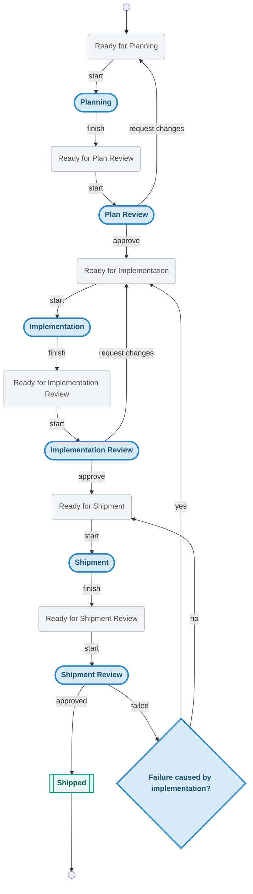

# Knots

[![CI][ci-badge]][ci-url]
[![Coverage][coverage-badge]][coverage-url]
[![License: MIT][license-badge]][license-url]

Knots is a local-first, git-backed Agentic Memory Management Framework designed for fast local workflows with append-only events and a SQLite cache.

# Install with curl
The installer pulls from GitHub Releases and installs to `${HOME}/.local/bin` by default.

Latest release:
```bash
curl -fsSL https://raw.githubusercontent.com/acartine/knots/main/install.sh | sh
```

# Why Knot
Yet another home-rolled agent memory thing when we already have Beads.  :-)

Its purpose is to provide a fast, opinionated workflow and responsibility enforcer.  Each knot allows for human-gating or agentic-delegation at each step of the workflow.  You decide what you need to see and what you don't.

# Basic Concepts
## Actions and Queues
Each step of the workflow is either an Action or a Queue.
- Action states are "In Progress".  They cannot be assigned.
- Queue states are, obviously, the opposite.

This makes it easy to see what needs to be done, and what is being worked on.

## Profiles
### Action Ownership and Output
Knots provides one workflow - but several profiles.  A profile assigns ownership to actions,
and in some cases it defines the output of action steps. This means you can have an Implementation Review step that is human gated, where the input is a branch, a PR, or a merged commit (gasp).  This provides granular control over what agents can do along with a a definition of done.

### Knot-Level Profiles
This means you can have different profiles for different knots.  You can decide if something is a 
small patch that skips planning and review, or a full-blown feature that goes through the full workflow.

## The Workflow


# Quick Start

The full flow from initialization to completion:

### 1. Initialize knots in your repo

```bash
$ kno init
```
```
═══════════════════════════════════════════
  FIT TO BE TIED 🎉
═══════════════════════════════════════════
  ▸ initializing local store
  ▸ opening cache database at .knots/cache/state.sqlite
  ▸ ensuring gitignore includes .knots rule
  ✔ local store initialized
  ▸ initializing remote branch origin/knots
  ⋯ this can take a bit...
  ✔ remote branch origin/knots initialized
```

This creates the `.knots/` directory, initializes the SQLite cache, adds
`.knots/` to `.gitignore`, and sets up the `origin/knots` tracking branch.

### 2. Create a knot

```bash
$ kno new "fix foo" --desc "The foo module panics on empty input"
```
```
created abc123 ready_for_planning fix foo
```

The knot enters the first queue state (`ready_for_planning`) and is
immediately available for an agent to pick up.

### 3. Claim the work

```bash
$ kno poll --claim
```
```
# fix foo

**ID**: abc123  |  **Priority**: 3  |  **Type**: work
**Profile**: autopilot  |  **State**: planning

## Description

The foo module panics on empty input

---

# Planning

## Input
- Knot in `ready_for_planning` state
- Knot title, description, and any existing notes/context

## Actions
1. Analyze the knot requirements and constraints
2. Research relevant code, dependencies, and prior art
3. Draft an implementation plan with steps, file changes, and test strategy
4. Estimate complexity and identify risks
5. Write the plan as a knot note via `kno update <id> --add-note "<plan>"`
6. Create a hierarchy of knots via `kno new "<title>"` for parent knots, `kno q "title"` for child knots and `kno edge <id> parent_of <id>` for edges

## Output
- Detailed implementation plan attached as a knot note
- Hierarchy of knots created
- Transition: `kno next <id>`

## Failure Modes
- Insufficient context: `kno update <id> --status ready_for_planning --add-note "<note>"`
- Out of scope / too complex: `kno update <id> --status ready_for_planning --add-note "<note>"`
```

`poll --claim` atomically grabs the highest-priority item, transitions it
from a queue state to its action state, and prints a self-contained
prompt blob. The output contains everything an agent needs: the knot
context, the skill instructions for the current step, and the exact
command to run when done.

### 4. Advance to the next state

When the agent finishes the work, it runs the completion command from the
prompt (or uses `kno next` for a shorthand advance):

```bash
$ kno next abc123
```
```
updated abc123 -> ready_for_plan_review
```

The knot moves to the next queue state, where it waits for the next
action to be claimed.

### Repeat

The agent loop is just two commands:

```bash
while true; do
  kno poll --claim || { sleep 30; continue; }
  # ... do the work described in the prompt ...
  # ... run the completion command from the output ...
done
```

Each iteration claims work, executes it, and advances the knot through
the workflow until it reaches `shipped`.

# Agent Integration

## Poll and Claim

`poll` and `claim` are the primary agent interface. CLI stdout IS the
prompt delivery mechanism — no file injection, no hooks, no
agent-specific APIs required.

```bash
kno poll                       # peek at the top claimable knot
kno poll implementation        # filter to a specific stage
kno poll --owner human         # show human-owned stages instead
kno poll --claim               # atomically grab the top item
kno poll --claim --json        # machine-readable output
kno claim <id>                 # claim a specific knot by id
kno claim <id> --json          # machine-readable claim
```

Agent metadata is recorded on each claim:
```bash
kno claim <id> \
  --agent-name "claude-code" \
  --agent-model "opus-4" \
  --agent-version "1.0"
```

## JSON output

Both commands support `--json` for programmatic consumption:

```json
{
  "id": "K-abc123",
  "title": "fix foo",
  "state": "planning",
  "priority": 3,
  "type": "work",
  "profile_id": "autopilot",
  "prompt": "# fix foo\n\n**ID**: abc123 ..."
}
```

## Consumption patterns

**Any agent runtime** (the command output IS the prompt):
```bash
kno poll --claim | agent-runner --prompt -
```

**Programmatic (Python, SDK, etc.)**:
```python
result = subprocess.run(["kno", "poll", "--claim", "--json"],
                        capture_output=True)
item = json.loads(result.stdout)
agent.run(prompt=item["prompt"])
```

**CI/CD**:
```yaml
- run: |
    WORK=$(kno poll --json)
    if [ -n "$WORK" ]; then
      kno claim $(echo $WORK | jq -r .id) --json | agent-runner
    fi
```

# Other Commands
Verify install:
```bash
kno --version
```

Update installed binary:
```bash
kno upgrade
kno upgrade --version v0.2.0
```

Uninstall installed binary:
```bash
kno uninstall
kno uninstall --remove-previous
```

## Core usage
Create a knot:
```bash
kno new "Document release pipeline" --state ready_for_implementation
kno new "Triage regression"                  # uses repo default profile
kno new "Hotfix gate" --profile semiauto
```

Update state:
```bash
kno state <knot-id> implementation
```

Patch fields with one command:
```bash
kno update <knot-id> \
  --title "Refine import reducer" \
  --description "Carry full migration metadata" \
  --priority 1 \
  --status implementation \
  --type work \
  --add-tag migration \
  --add-note "handoff context" \
  --note-username acartine \
  --note-datetime 2026-02-23T10:00:00Z \
  --note-agentname codex \
  --note-model gpt-5 \
  --note-version 0.1
```

List and inspect:
```bash
kno ls
kno ls               # shipped knots hidden by default
kno ls --all         # include shipped knots
kno ls --state implementation --tag release
kno ls --profile semiauto
kno ls --type work --query importer
kno show <knot-id>
kno show <knot-id> --json
```

Sync from dedicated `knots` branch/worktree:
```bash
kno sync
```

Manage dependency edges:
```bash
kno edge add <src-id> blocked_by <dst-id>
kno edge list <src-id> --direction outgoing
kno edge remove <src-id> blocked_by <dst-id>
```

Import supports parity fields when present:
- `description`, `priority`, `issue_type`/`type`
- `labels`/`tags`
- `notes` as legacy string or structured array entries
- `handoff_capsules` structured array entries

# Developing
For information on the release process and local development testing, please see [CONTRIBUTING.md](CONTRIBUTING.md).


## Security and support
- Security policy: see `SECURITY.md`
- Non-security bugs/feature work: open a normal GitHub issue
- Installation/release regressions: open issue with logs and platform details

### Enable private vulnerability reporting (GitHub)
After publishing the repository:
1. Open repository `Settings`.
2. Open `Security & analysis`.
3. Enable `Private vulnerability reporting`.
4. Confirm `SECURITY.md` is discoverable from the repository root.

## License
MIT. See `LICENSE`.

[ci-badge]: https://github.com/acartine/knots/actions/workflows/ci.yml/badge.svg
[ci-url]: https://github.com/acartine/knots/actions/workflows/ci.yml
[coverage-badge]: https://codecov.io/gh/acartine/knots/graph/badge.svg?branch=main
[coverage-url]: https://codecov.io/gh/acartine/knots
[license-badge]: https://img.shields.io/badge/License-MIT-yellow.svg
[license-url]: https://opensource.org/licenses/MIT
