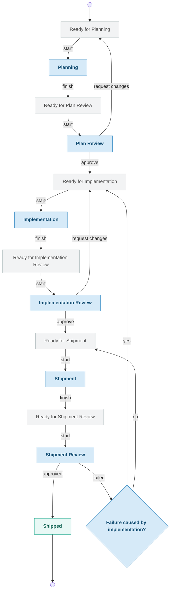

```mermaid
graph TD
  classDef queue fill:#F2F3F4,stroke:#AAB7B8,color:#555555
  classDef action fill:#D6EAF8,stroke:#2E86C1,color:#1A5276,font-weight:bold
  classDef terminal fill:#E8F8F5,stroke:#17A589,color:#0E6251,font-weight:bold

  START(( )) --> QP[Ready for Planning]:::queue

  %% --- Planning ---
  QP -->|start| P[Planning]:::action
  P -->|finish| QPR[Ready for Plan Review]:::queue
  QPR -->|start| PR[Plan Review]:::action

  PR -->|approve| QI[Ready for Implementation]:::queue
  PR -->|request changes| QP:::queue

  %% --- Implementation ---
  QI -->|start| I[Implementation]:::action
  I -->|finish| QIR[Ready for Implementation Review]:::queue
  QIR -->|start| IR[Implementation Review]:::action

  IR -->|approve| QS[Ready for Shipment]:::queue
  IR -->|request changes| QI:::queue

  %% --- Shipment ---
  QS -->|start| S[Shipment]:::action
  S -->|finish| QSR[Ready for Shipment Review]:::queue
  QSR -->|start| SR[Shipment Review]:::action

  %% --- Shipment outcomes / routing ---
  SR -->|approved| SHIPPED[Shipped]:::terminal
  SR -->|failed| RCA{Failure caused by implementation?}:::action
  RCA -->|yes| QI:::queue
  RCA -->|no| QS:::queue

  SHIPPED --> END(( ))
```
